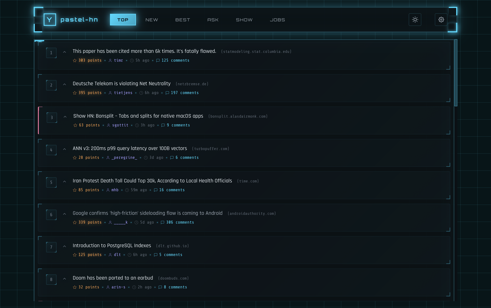

# pastel-hn

**The best Hacker News desktop client** - A cross-platform desktop app with stunning Cyberpunk Pastel aesthetics, built for comfortable reading and keyboard-centric navigation.

Built with [Tauri](https://tauri.app) - combining a TypeScript/HTML/CSS frontend with a Rust backend for native-like performance and small binary size.


## Screenshots

| Dark Theme | Light Theme |
|:----------:|:-----------:|
|  |  |

## Features

- **All HN Feeds** - Top, New, Best, Ask, Show, Jobs with instant switching
- **Threaded Comments** - Collapsible comment trees with smooth animations and depth indicators
- **Zen Mode** - Distraction-free reading with fullscreen and hidden UI (`z` key)
- **Search** - Algolia-powered search with filters (stories/comments, date/relevance)
- **User Profiles** - View karma, about, and submission history
- **Keyboard Navigation** - Full keyboard support for power users
- **Dark/Light Themes** - Cyberpunk Pastel aesthetic with system preference support
- **Customizable** - Font size, density, and default feed settings
- **Window State** - Remembers window position and size across sessions

## Tech Stack

```
┌─────────────────────────────────────────────┐
│  TypeScript (UI Layer)                      │
│  - Vite + vanilla TypeScript                │
│  - Virtual scrolling for performance        │
│  - CSS with Cyberpunk Pastel design system  │
└─────────────────┬───────────────────────────┘
                  │ Tauri IPC
┌─────────────────▼───────────────────────────┐
│  Rust (Data Layer)                          │
│  - Tauri 2.x for native desktop shell       │
│  - reqwest for HTTP with connection pooling │
│  - moka for in-memory caching               │
│  - tokio for async concurrent fetching      │
│  - tracing for structured logging           │
└─────────────────────────────────────────────┘
```

## Keyboard Shortcuts

| Key | Action |
|-----|--------|
| `j` / `k` | Navigate down / up |
| `Enter` | Open story / expand comments |
| `o` | Open link in browser |
| `c` | Focus comments section |
| `z` | Toggle Zen mode |
| `d` | Toggle dark/light theme |
| `Escape` | Go back / exit Zen mode |
| `r` | Refresh current feed |
| `1-6` | Switch feeds (top/new/best/ask/show/jobs) |
| `/` | Focus search |
| `t` | Scroll to top |
| `?` | Show keyboard shortcuts |
| `⌘Q` | Quit app (Ctrl+Q on Windows/Linux) |

## Development

### Prerequisites

- [Bun](https://bun.sh) (v1.0+)
- [Rust](https://rustup.rs) (stable)
- [Task](https://taskfile.dev) (optional, for task runner)

### Setup

```bash
# Install web dependencies
cd web && bun install

# Build and run in development
task dev:tauri
# or without Task:
cd src-tauri && cargo tauri dev
```

### Available Tasks

```bash
task                  # Show all available tasks
task dev:web          # Start web dev server
task dev:tauri        # Start Tauri dev mode
task build:web        # Build web frontend
task build:tauri      # Build desktop app
task test             # Run all tests
task fmt              # Format code
task check            # Type check
```

### Project Structure

```
pastel-hn/
├── web/                     # Frontend (TypeScript)
│   ├── src/
│   │   ├── main.ts          # App entry & UI rendering
│   │   ├── api.ts           # Tauri invoke wrappers
│   │   ├── types.ts         # TypeScript types
│   │   ├── keyboard.ts      # Keyboard navigation
│   │   ├── theme.ts         # Theme management
│   │   ├── settings.ts      # Settings panel
│   │   ├── toast.ts         # Toast notifications
│   │   ├── virtual-scroll.ts# Virtual scrolling
│   │   └── styles/main.css  # Cyberpunk styles
│   └── index.html
├── src-tauri/               # Backend (Rust)
│   ├── src/
│   │   ├── main.rs          # Tauri app setup
│   │   ├── client.rs        # HN API client + caching
│   │   ├── commands.rs      # Tauri command handlers
│   │   └── types.rs         # Rust types with serde
│   └── Cargo.toml
├── docs/rationale/          # Architecture Decision Records
├── Taskfile.yml             # Task runner config
└── VERSION
```

## Architecture Decisions

- [ADR-0001: Removing Zig/WASM Layer](docs/rationale/0001_removing_zig_wasm_layer.md)
- [ADR-0002: Rust API Layer](docs/rationale/0002_rust_api_layer.md)

## Design Philosophy

- **Reader-First** - Optimized for comfortable, extended reading sessions
- **Visual Hierarchy** - Clear distinction between content types
- **Responsive Feedback** - Every interaction feels immediate (<100ms)
- **Keyboard-Centric** - Power users can navigate entirely without a mouse
- **Beautiful by Default** - Stunning visuals that don't sacrifice usability

## Caching Strategy

The Rust backend implements intelligent caching:

| Cache | TTL | Max Size |
|-------|-----|----------|
| Items (stories/comments) | 5 minutes | 10,000 |
| Story IDs per feed | 2 minutes | 10 |
| User profiles | 10 minutes | 100 |

## License

MIT
