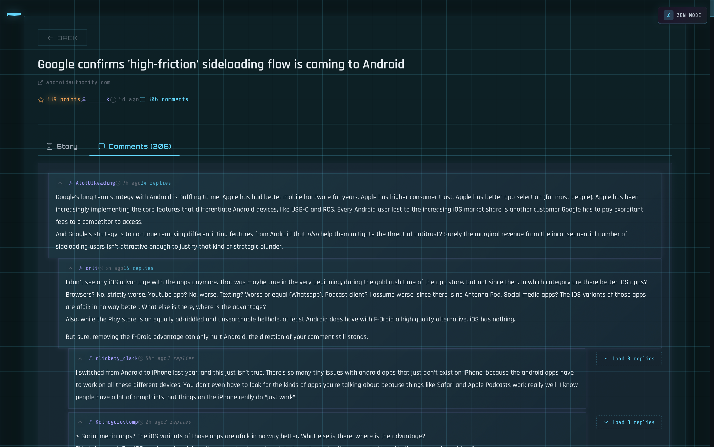
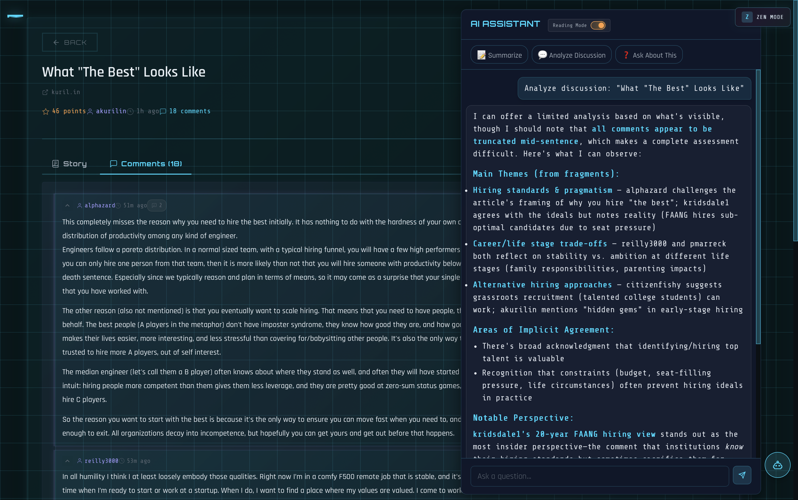

# pastel-hn

**The best Hacker News desktop client** - A cross-platform desktop app with stunning Cyberpunk Pastel aesthetics, built for comfortable reading and keyboard-centric navigation.

Built with [Tauri](https://tauri.app) - combining a TypeScript/HTML/CSS frontend with a Rust backend for native-like performance and small binary size.


## Screenshots

| Dark Theme | Light Theme |
|:----------:|:-----------:|
|  |  |
| **Article View** | **Comments View** |
|  |  |
| **AI Assistant (Dark)** | **AI Assistant (Light)** |
|  |  |

## Features

- **All HN Feeds** - Top, New, Best, Ask, Show, Jobs, plus Saved (bookmarks) with instant switching
- **Bookmarks** - Save stories locally for offline reading with dedicated Saved feed
- **Offline Support** - Offline indicator in header; view cached bookmarks when disconnected
- **Article Reader** - Read articles inline without leaving the app (Mozilla Readability extraction)
- **Threaded Comments** - Collapsible comment trees with smooth animations and depth indicators
- **Lazy Comment Loading** - Initial shallow fetch with on-demand deep loading for fast performance
- **Intelligent Prefetching** - Prefetches stories on hover, near scroll end, and during idle time
- **Background Refresh** - Automatically refreshes stale data and shows "new stories available" banner
- **Zen Mode** - Distraction-free reading with fullscreen and hidden UI (`z` key)
- **Vim-Style Navigation** - Full `j`/`k` navigation in both list and detail views
- **Search** - Algolia-powered search with filters (stories/comments, date/relevance)
- **User Profiles** - View karma, about, and submission history
- **Keyboard Navigation** - Full keyboard support for power users
- **Dark/Light Themes** - Cyberpunk Pastel aesthetic with system preference support
- **Customizable** - Font size (compact/normal/comfortable), density, and default feed settings
- **Reading Progress** - Tracks read stories, new comments, and scroll positions
- **Trending Indicators** - Shows rising/hot badges for rapidly trending stories
- **Duplicate Detection** - Identifies stories linking to the same URL across feeds
- **Reading Time** - Estimated read time displayed for articles
- **Window State** - Remembers window position and size across sessions
- **AI Assistant** - GitHub Copilot-powered reading assistant (optional, desktop only)

## Tech Stack

```
┌─────────────────────────────────────────────┐
│  TypeScript (UI Layer)                      │
│  - Vite + vanilla TypeScript                │
│  - Virtual scrolling for performance        │
│  - CSS with Cyberpunk Pastel design system  │
└─────────────────┬───────────────────────────┘
                  │ Tauri IPC
┌─────────────────▼───────────────────────────┐
│  Rust (Data Layer)                          │
│  - Tauri 2.x for native desktop shell       │
│  - reqwest for HTTP with connection pooling │
│  - moka for in-memory caching               │
│  - tokio for async concurrent fetching      │
│  - tracing for structured logging           │
└─────────────────────────────────────────────┘
```

## Keyboard Shortcuts

### List View

| Key | Action |
|-----|--------|
| `j` / `k` | Navigate down / up through stories |
| `Enter` | Open selected story |
| `o` | Open link in browser |
| `f` | Filter YouTube videos |
| `r` | Refresh current feed |
| `1-7` | Switch feeds (top/new/best/ask/show/jobs/saved) |
| `/` | Focus search |
| `t` | Scroll to top |
| `d` | Toggle dark/light theme |
| `?` | Show keyboard shortcuts |

### Detail View (Story/Article)

| Key | Action |
|-----|--------|
| `j` / `k` | Scroll down / up |
| `g` | Jump to top |
| `G` | Jump to bottom |
| `c` | Focus comments section |
| `o` | Open article in browser |
| `b` / `Escape` | Back to list (preserves Zen mode) |
| `z` | Toggle Zen mode |
| `a` | Toggle AI assistant panel |

### Global

| Key | Action |
|-----|--------|
| `⌘Q` | Quit app (Ctrl+Q on Windows/Linux) |

## Development

### Prerequisites

- [Bun](https://bun.sh) (v1.0+)
- [Rust](https://rustup.rs) (stable)
- [Task](https://taskfile.dev) (optional, for task runner)

### Setup

```bash
# Install web dependencies
cd web && bun install

# Build and run in development
task dev:tauri
# or without Task:
cd src-tauri && cargo tauri dev
```

### Available Tasks

```bash
task                  # Show all available tasks
task dev:web          # Start web dev server
task dev:tauri        # Start Tauri dev mode
task build:web        # Build web frontend
task build:tauri      # Build desktop app
task test             # Run all tests
task fmt              # Format code
task check            # Type check
```

### Project Structure

```
pastel-hn/
├── web/                     # Frontend (TypeScript)
│   ├── src/
│   │   ├── main.ts          # App entry & orchestration
│   │   ├── story-list.ts    # Feed rendering & pagination
│   │   ├── story-detail.ts  # Story view & comments
│   │   ├── user-profile.ts  # User profile view
│   │   ├── navigation.ts    # Routing & action handlers
│   │   ├── scroll-utils.ts  # Scroll position management
│   │   ├── api.ts           # Tauri invoke wrappers
│   │   ├── types.ts         # TypeScript types
│   │   ├── keyboard.ts      # Keyboard navigation
│   │   ├── theme.ts         # Theme management
│   │   ├── settings.ts      # Settings panel
│   │   ├── storage.ts       # Local storage (bookmarks, state)
│   │   ├── offline.ts       # Offline detection
│   │   ├── toast.ts         # Toast notifications
│   │   ├── prefetch.ts      # Intelligent prefetching
│   │   ├── virtual-scroll.ts# Virtual scrolling
│   │   └── styles/main.css  # Cyberpunk styles
│   └── index.html
├── src-tauri/               # Backend (Rust)
│   ├── src/
│   │   ├── main.rs          # Tauri app setup
│   │   ├── client.rs        # HN API client + caching
│   │   ├── commands.rs      # Tauri command handlers
│   │   ├── copilot.rs       # AI assistant service
│   │   └── types.rs         # Rust types with serde
│   └── Cargo.toml
├── docs/rationale/          # Architecture Decision Records
├── Taskfile.yml             # Task runner config
└── VERSION
```

## Architecture Decisions

- [ADR-0001: Removing Zig/WASM Layer](docs/rationale/0001_removing_zig_wasm_layer.md)
- [ADR-0002: Rust API Layer](docs/rationale/0002_rust_api_layer.md)
- [ADR-0003: Tabbed Story Detail with Reader Mode](docs/rationale/0003_tabbed_story_detail_with_reader_mode.md)
- [ADR-0004: Error Handling Pattern](docs/rationale/0004_error_handling_pattern.md)
- [ADR-0005: UI Design System](docs/rationale/0005_ui_design_system.md)
- [ADR-0006: Copilot AI Assistant](docs/rationale/0006_copilot_ai_assistant.md)

## Design Philosophy

- **Reader-First** - Optimized for comfortable, extended reading sessions
- **Visual Hierarchy** - Clear distinction between content types
- **Responsive Feedback** - Every interaction feels immediate (<100ms)
- **Keyboard-Centric** - Power users can navigate entirely without a mouse
- **Beautiful by Default** - Stunning visuals that don't sacrifice usability

## AI Assistant (Optional)

The desktop app includes an optional AI-powered reading assistant, powered by GitHub Copilot:

- **Summarize Articles** - Get quick summaries of linked articles
- **Analyze Discussions** - Understand key viewpoints in long comment threads
- **Explain Terms** - Context menu to explain technical jargon
- **Draft Replies** - Help compose thoughtful HN comments

### Requirements

- GitHub Copilot subscription
- GitHub Copilot CLI installed (`gh copilot` or standalone `copilot`)

The assistant is automatically enabled when Copilot is available. Without it, the app works normally—AI features are entirely optional.

## Caching Strategy

The Rust backend implements intelligent caching with stale-while-revalidate:

| Cache | TTL | Max Size | Stale Threshold |
|-------|-----|----------|-----------------|
| Items (stories/comments) | 5 minutes | 10,000 | - |
| Story IDs per feed | 2 minutes | 10 | 75% (90s) |
| User profiles | 10 minutes | 100 | - |

When feed data reaches 75% of its TTL, the app serves cached data immediately while triggering a background refresh. If new stories are found, a "new stories available" banner appears for one-click refresh.

## License

MIT
